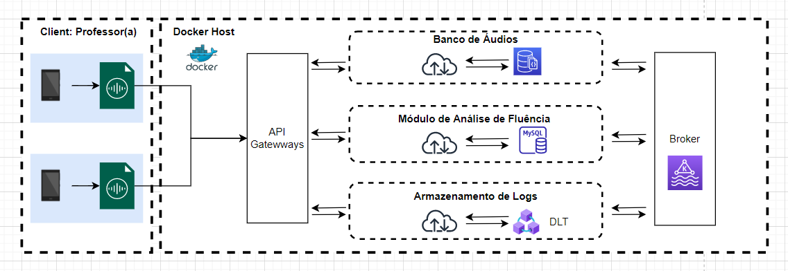

# Collect Audio Streaming

Developing **Proof of Concept (PoC)** for project **MEC-ITA** using Streaming Technology.

## Requirements Front-End

Functional Requirements to Front-End

| Requitements ID  | Description  |
|---|---|
|  RF1 | Captar Áudio  |
|  RF2 | Escutar Gravação  |
|  RF3 | Enviar Áudio  |

## Requirements Back-End

Functional Requirements to Back-End

| Requitements ID  | Description  |
|---|---|
|  RF1 | A transferência deve estar criptografada  |
|  RF2 | Os dados relativos à transferência devem ser registrados (data, hora, local)  |
|  RF3 | Os dados de áudio devem ser acessíveis ao Módulo de Análise de Fluência  |

Non Functional Requirements to Back-End

| Requitements ID  | Description  |
|---|---|
|  RNF1 | A transferência não deve ultrapassar 30 s  |
|  RNF2 | Os dados de áudio não podem estar danificados  |
|  RNF3 | Os dados de áudio não podem ser alterados  |

## Technologies

Basic technologies useds in this project.

**Front-End**

* [PHP](https://www.php.net/) (Programming Language)
* [Laravel](https://laravel.com/) (Framework)

**Front-End**

* [Kafka](https://kafka.apache.org/) (Streaming)
* [Docker](https://www.docker.com/) (Container)

**Data Base (DB)**

* [MySQL](https://www.mysql.com/) (DB SQL)
* [MongoDB](https://www.mongodb.com/) (DB NoSQL)

